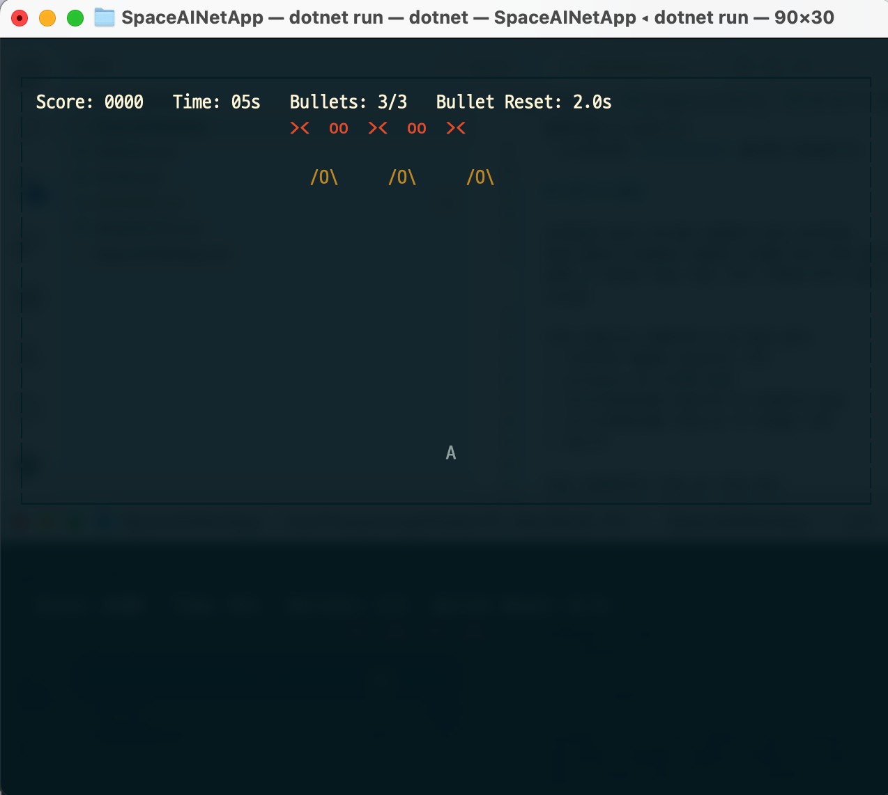
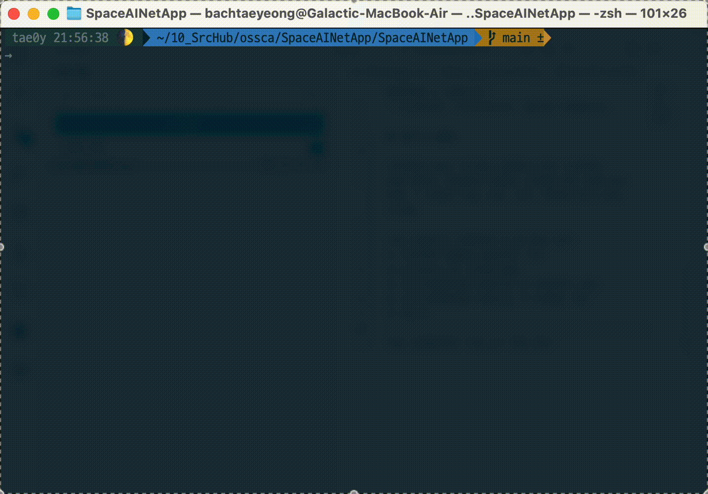

# Space.AI.NET()

C# 콘솔 Space Invaders 스타일 게임

## 실행 방법

1. .NET SDK가 설치되어 있어야 합니다. (https://dotnet.microsoft.com/download)
2. 터미널에서 프로젝트 폴더로 이동합니다.
   ```zsh
   cd /SpaceAINetApp
   ```
3. 아래 명령어로 바로 실행합니다.
   ```zsh
   dotnet run
   ```

## 게임 조작법
- ← : 왼쪽 이동
- → : 오른쪽 이동
- SPACE : 총알 발사
- S : 스크린샷 저장
- Q : 게임 종료

## 기타
- 실행 시 StartScreen이 표시됩니다.
- 콘솔 창 크기를 충분히 확보하면 더 쾌적하게 플레이할 수 있습니다.
- 스크린샷은 `screenshoots` 폴더에 저장됩니다.

## 후기 & 결과

코파일럿 Agent 모드를 사용해서 만든 프로젝트.
특정 클래스 파일에서 중괄호 오류를 여러 차례 잡지 못해 그 부분만 직접 수정. 모두 구현하기까지 26턴 소요됨.

이런 흐름으로 진행하면 더 잘 될것 같다.
1) 프로젝트 템플릿 생성부터 시작
2) gitignore 등 사전에 설정
3) 요구사항명세를 바탕으로 빈 파일부터 생성
4) 요구사항명세를 바탕으로 각 파일을 구현
5) 테스트

실행화면 캡처


실행화면 gif
